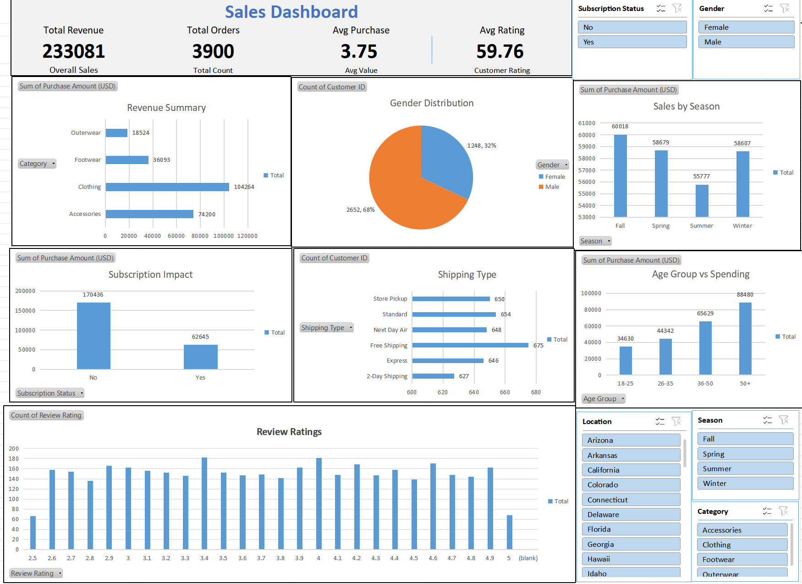

# 📊 Customer Sales Dashboard (Excel)

## 📌 Overview

This project showcases an **interactive Sales Dashboard** built using Microsoft Excel to analyze customer purchase behavior, sales performance, and business insights.

The dashboard provides a clear and dynamic view of sales data using Pivot Tables, Charts, and Slicers.

---

## 🎯 Objectives

* Analyze sales across different product categories
* Understand customer demographics (Age, Gender)
* Identify seasonal sales trends
* Evaluate customer satisfaction through ratings
* Build an interactive dashboard using Excel

---

## 📁 Dataset

The dataset includes the following features:

* Customer ID
* Age
* Gender
* Item Purchased
* Category
* Purchase Amount (USD)
* Location
* Size
* Color
* Season
* Review Rating
* Subscription Status
* Shipping Type
* Discount Applied
* Promo Code Used
* Previous Purchases
* Payment Method
* Frequency of Purchases

---

## 📊 Dashboard Features

### 🔹 KPI Metrics

* Total Revenue
* Total Orders
* Average Purchase Value
* Average Rating

---

### 🔹 Visualizations

* Sales by Category
* Sales by Season
* Gender Distribution
* Age Group vs Spending
* Subscription Impact
* Shipping Type Analysis
* Review Ratings Distribution

---

## 🎛️ Interactivity

The dashboard includes slicers for:

* Category
* Gender
* Season
* Location
* Subscription Status

👉 These allow dynamic filtering of all charts and KPIs.

---

## 🛠️ Tools & Techniques

* Microsoft Excel
* Pivot Tables
* Pivot Charts
* Slicers
* Data Cleaning
* Data Analysis

---

## 📷 Dashboard Preview

---

## 📈 Key Insights

* Clothing category contributes the highest revenue
* Majority of customers are male
* Non-subscribed customers generate more revenue
* Customer ratings are mostly positive (3–5 range)
* Spending tends to increase with age group

---

## 🚀 How to Use

1. Download the Excel file
2. Open in Microsoft Excel
3. Use slicers to filter data
4. Explore insights interactively

---

## 📌 Future Improvements

* Add time-based trend analysis
* Include profit and cost metrics
* Create Power BI version
* Add customer segmentation

---

## 👩‍💻 Author

**Dhivya**

---

## ⭐ Support

If you like this project, please give it a ⭐ on GitHub!
